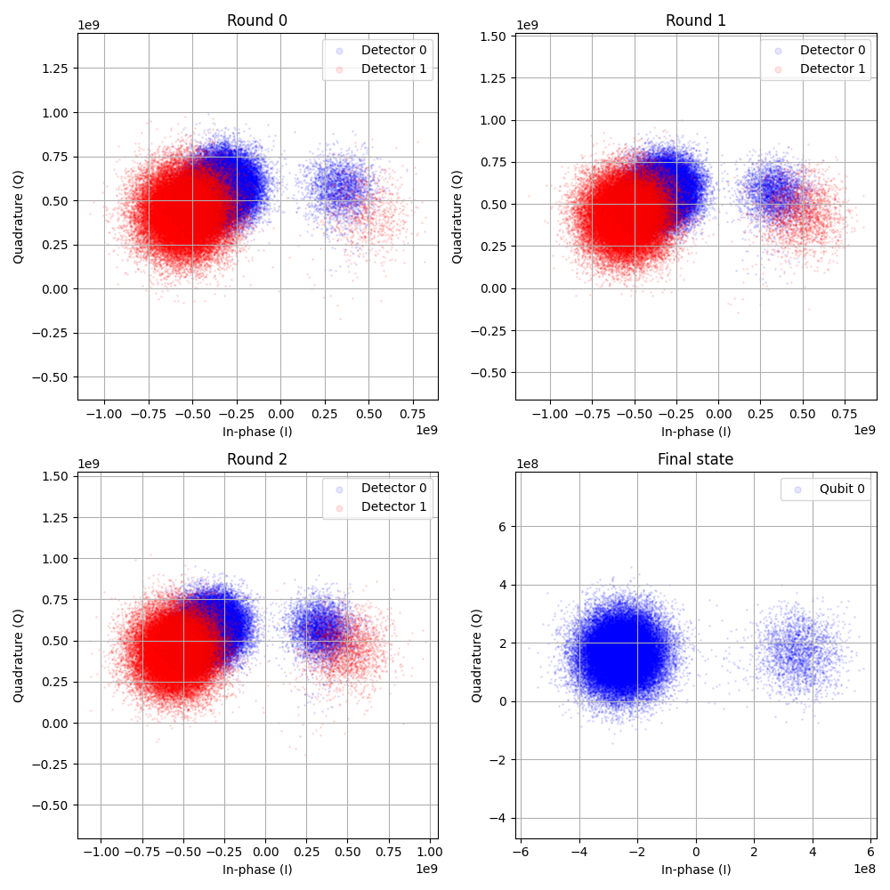
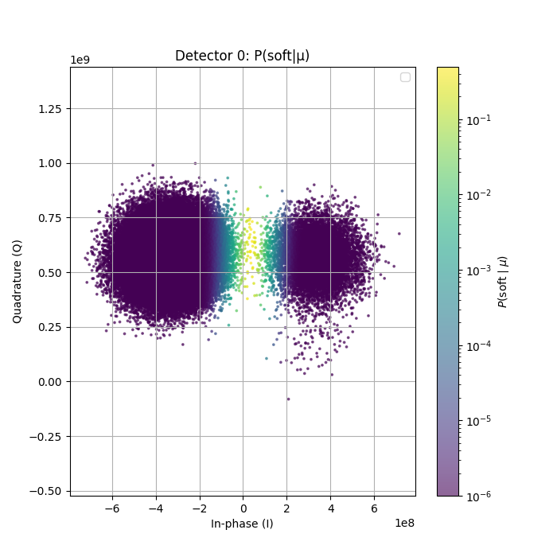
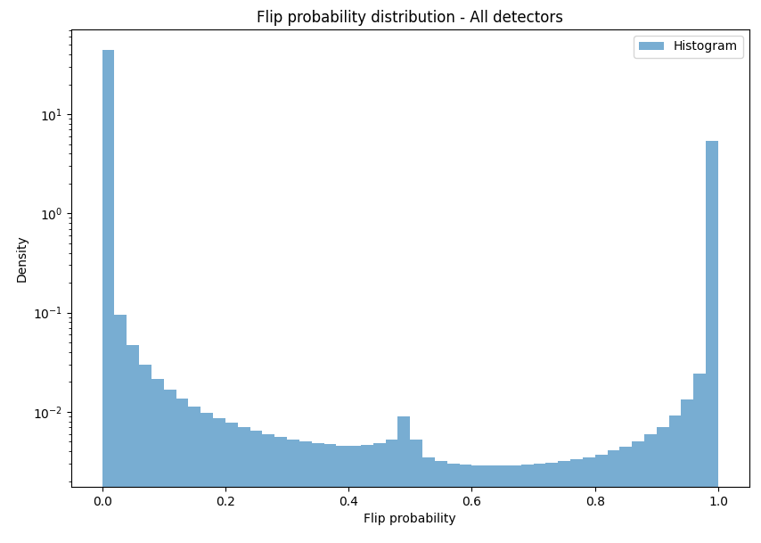
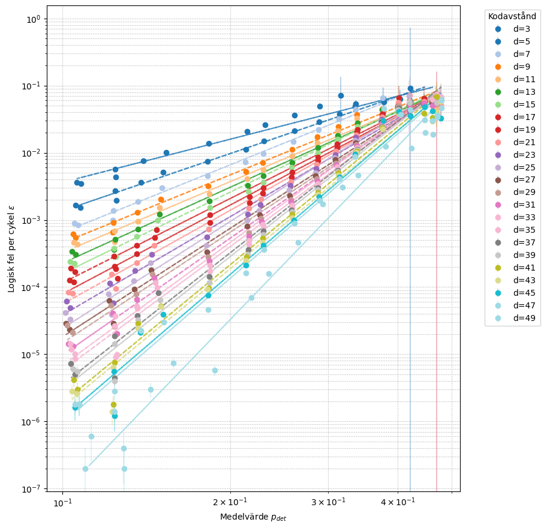
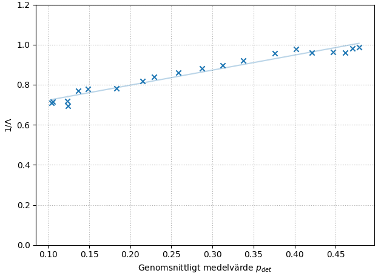
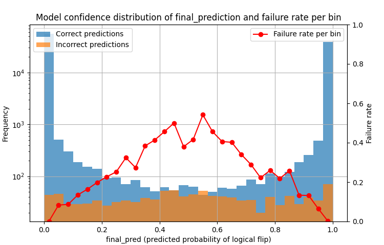
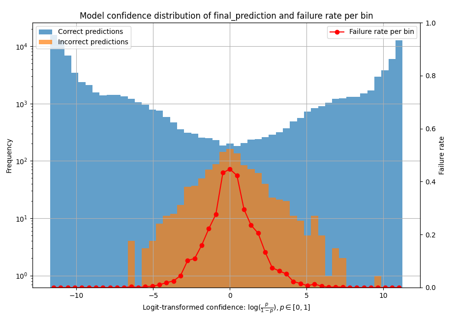

# Summer Project 2025: Data-Driven Decoding of the Repetition Code with GNN+RNN

by **Vidar Petersson**

This repository is a fork of the project and master’s thesis *“Sequential Graph-Based Decoding of the Surface Code using a Hybrid Graph and Recurrent Neural Network Model”* ([GitHub link](https://github.com/Olfj/QEC_GNN-RNN)).

During this project, I have focused on the following areas:
* Decoding of IQ data
* *Turning the knob*
* *Train-at-all-times*
* Evaluation and optimization of GNN+RNN
* Threshold and maximum-likelihood analysis for decoders

---

## Data pipeline

### Generating data

1. **repetition\_code\_circuit.py**
   Constructs a lean repetition code circuit. Should not need modification; parameters control its behavior.

2. **repetition\_code\_execute.py**
   Executes the circuit either on IBM hardware or the local Aer simulator.

   * Note: Aer cannot generate IQ data.
   * For batch execution across parameters, use `examples/batch_execution_rep_code.py`.

**Naming convention discrepancy:**
File names include the number of actual time repetitions, while in this project `t` refers to the number of detectors along the time axis. To reconcile: ```t_project = t_filename + 1```

### Decoder

1. **dataloader\_ibm.py**
   Loads data from JSON files and returns detection events + logical flips (either probabilities `P(b=1)` or binary values).

2. **graph\_creator.py**
   Builds graphs for the GNN decoder.

3. **gru\_decoder.py**
   Contains the GNN+RNN decoder, along with training and testing methods.

Additionally:

* **mwpm\_decoder\_ibm.py**
  Decodes jobdata with the MWPM algorithm. Serves as a benchmark but does **not** currently use soft info from IQ data. It constructs its own graphs directly from detection events.

---

## Misc project files

* **args.py** Contains the `Args` dataclass for configuring training/inference.
* **training\_utils.py** Helper methods for training.

---

## Project structure

```
├───data_analysis
│   ├───data                # CSV files after data analysis
│   ├───misc                # Matplotlib settings for plotting
│   ├───training_curves     # Files downloaded directly from Wandb
├───decoder_binary          # Decoding pipeline for meas_type="classified"
├───decoder_iq              # Decoding pipeline for meas_type="kerneled"
├───examples                # Example scripts for loading, training, and testing the decoder
├───figures
├───jobdata                 # JSON files with simulated or experimental data
│   ├───aer
│   │   └───pre_training
│   └───ibm
│       ├───iq_data
│       │   └───training_data
│       ├───noise_angle_pittsburgh_500rep
│       ├───noise_angle_pittsburgh_50rep
│       ├───old_testdata
│       ├───threshold
│       └───turning_the_knob
├───models                  # Model weights and biases trained on jobdata
├───repetition_code
│   ├───old_repcode         # Old version of the repetition code, e.g. resetting ancillas
```
---

## Focus Areas

### 1. Decoding IQ data

Based on [arXiv:2411.16228](https://arxiv.org/abs/2411.16228).
Instead of binary measurement outcomes, raw IQ data is collected, allowing uncertainty estimation of classification. This soft information is used both as a node feature and in the loss function.

**Key difference from the paper:**
They train classifiers using two calibration circuits; I use only execution data.

   

Distribution of detection-event probabilities:

  

**TODO:**

* Replace GMM-based IQ classification with KDE (suggested in the paper).
* Apply a transformation (e.g. `logit()`) to emphasize small variations near 0 and 1.
* Implement a soft-info MWPM decoder for comparison.

---

### 2. Turning the knob

Based on [arXiv:2505.22741](https://arxiv.org/abs/2505.22741).
Noise is artificially increased by applying RZ rotations on data qubits each time step. Larger angles \$\alpha\$ increase average detection probability \$p\_{det}\$.

Hypothesis: Training on noisier data should improve decoding of less noisy data, due to broader syndrome variation exposure.

**TODO:**

* No clear evidence yet that this method improves performance.
* Investigate which \$p\_{det}\$ yields optimal training data.
* Plot validation curves for low-noise datasets when trained on high-noise data.
* An anomaly observed: \$\alpha \sim 0.1653\$ sometimes yields lower \$p\_{det}\$ than \$\alpha = 0\$. Cause unknown.

---

### 3. Train-at-all-times

Idea: Measure the logical state at **every** time repetition, giving the network more training signals. If `train_at_all_times=True`, intermediate states are included in the loss.

So far, no evidence of improved performance. Current datasets contain no intermediate measurements.

**TODO:**

* Rewrite repetition code if this is to be tested.
* Investigate impact of intermediate measurements on \$p\_{det}\$.

---

### 4. Evaluation and optimization of GNN+RNN

The model structure and hyperparameters were taken from the original surface-code project (STIM data). Adaptation to repetition code datasets may require optimization.

**Previous overfitting issue (10–20 epochs) mitigated by:**

* Switching LR schedule: exponential → `ReduceLROnPlateau()`
* Adding dropout to GRU and GNN
* Increasing batch size to 512
* Adding weight decay with `AdamW()`

**TODO:**

* Further optimize hyperparameters and architecture.
* Explore batch normalization.
* Study performance vs. time-step length `dt`.
* Add residual connections between GNN layers.
* Add attention after GRU.

---

### 5. Threshold and Maximum-Likelihood Analysis

Inspired by [arXiv:2408.13687](https://arxiv.org/abs/2408.13687).

   

**TODO:**

* Investigate why the slope is effectively half the theoretical value.
* Extend to datasets with larger time steps.
* Improve subsampling: currently, all chains of length *d* are merged. Ideally, each subsampled segment should have its own \$p\_{ij}\$ and be decoded separately.

We also examined distributions of the GNN decoder’s `final_prediction`:

    

---

## Installation

First-time setup:

```bash
git clone https://github.com/Vidar-Petersson/QEC_GNN-RNN_IBM.git
cd QEC_GNN-RNN_IBM
pip3 install -r requirements.txt
```

Download jobdata files from the shared storage:

```
/mimer/NOBACKUP/groups/snic2021-23-319/vidar_petersson_IBM_data/jobdata
```

and place them in `./jobdata`.

Login to Weights & Biases:

```bash
wandb login
```

Run training/testing on jobdata files:

```bash
python3 examples/test_nn.py
```

---

## Running on Alvis Cluster

To run `./examples/train_nn.py` and verify jobs on Alvis:

First time (create environment):

```bash
./create_container
```

Submit job:

```bash
sbatch run_jobscript.sh
squeue --me
```

Cancel job:

```bash
scancel JOBID
```

Run Python scripts inside container:

```bash
apptainer exec bash_container.sif python file.py
```
